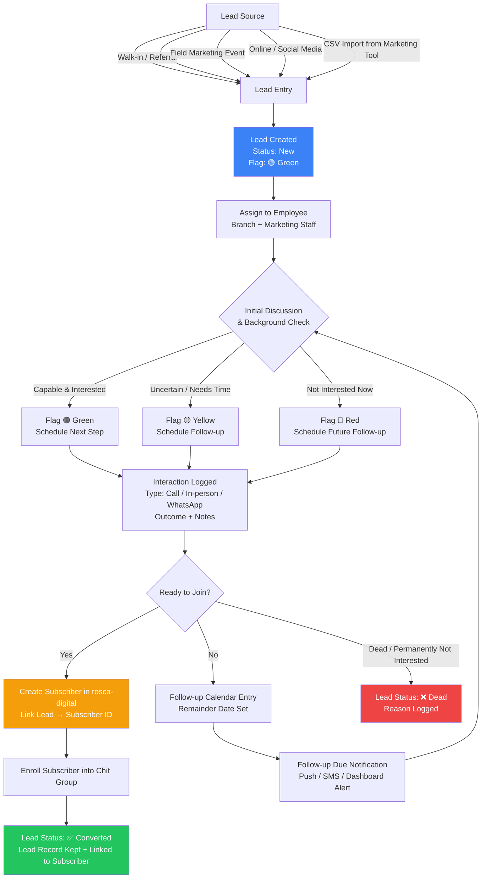

# CRM Lead Management — System Design & Phases

## Context

DNC CHITS currently uses a separate marketing tool for lead tracking. The goal is to bring lead management natively into rosca-digital (Laravel) so that marketing staff, branch executives, and back-office users work in one unified system. The end state: a lead enters the CRM → gets nurtured with follow-ups → gets assessed (flagged green/yellow/red) → is converted into a rosca-digital Subscriber and enrolled into a group, all within the same platform.

Existing rosca-digital already has: `Subscriber`, `Interaction`, `Employee`, `Branch`, `User`, `Document`, `Enrollment` models plus a robust task/process framework, role-based access, and Pusher real-time updates. The CRM will sit on top of this foundation.

---

## System Flow Diagram



---

## Data Model

### New: `leads` table

| Field | Type | Notes |
|---|---|---|
| `id` | bigint PK | |
| `lead_no` | string | Auto-generated: `{BRANCH_CODE}-{SEQUENCE}` e.g. `ARN-02783` |
| `name` | string | Prospect name |
| `mobile_primary` | string | Primary contact |
| `mobile_alternate` | string | nullable |
| `email` | string | nullable |
| `branch_id` | FK → branches | Which branch owns this lead |
| `assigned_to` | FK → employees | Assigned marketing/field staff |
| `source` | enum | `direct`, `referral`, `event`, `social_media`, `import` |
| `status` | enum | `new`, `in_progress`, `converted`, `dead` |
| `flag` | enum | `green`, `yellow`, `red` |
| `subscriber_id` | FK → subscribers | nullable — populated on conversion |
| `input_date` | date | Date lead was entered |
| `converted_at` | timestamp | nullable |
| `dead_at` | timestamp | nullable |
| `notes` | text | General notes |
| `created_by` | FK → users | |
| `updated_by` | FK → users | |
| timestamps + soft deletes | | |

### New: `lead_interactions` table

| Field | Type | Notes |
|---|---|---|
| `id` | bigint PK | |
| `lead_id` | FK → leads | |
| `user_id` | FK → users | Who logged this |
| `type` | enum | `phone`, `in_person`, `whatsapp`, `email` |
| `interaction_date` | datetime | When it happened |
| `outcome` | text | What was discussed |
| `flag_after` | enum | `green`, `yellow`, `red` — flag set after this interaction |
| `follow_up_date` | date | nullable — next follow-up |
| `follow_up_note` | text | nullable — reminder note |
| `follow_up_status` | enum | `pending`, `done`, `missed` |
| timestamps | | |

### Existing models reused as-is

- `Subscriber` — created on conversion, linked via `leads.subscriber_id`
- `Enrollment` — created after conversion, standard rosca-digital flow
- `Employee` — assigned to leads via `leads.assigned_to`
- `Branch` — leads belong to a branch
- `User` — `created_by`, `updated_by`, and interaction logging

---

## Access Control

| Role | Can Do |
|---|---|
| `MARKETING_STAFF` (new) | Create leads, log interactions, view own leads |
| `BRANCH_HEAD` / `BCE` (existing) | View all branch leads, reassign, convert to subscriber |
| `ORG_ADMIN` / `SUPER_ADMIN` (existing) | Full access, reports, bulk import |
| `SUBSCRIBER` (existing) | No access |

---

## UI Screen Designs (per Phase)

### Screen 1 — Lead List (Phase 1)

```
┌─────────────────────────────────────────────────────────────────────────────┐
│  DNC CHITS  > CRM > Leads                                    [+ New Lead]   │
├─────────────────────────────────────────────────────────────────────────────┤
│  Filter: [All Branches ▼] [All Employees ▼] [Status ▼] [Flag ▼] [Search 🔍]│
├────┬──────────┬────────────┬─────────────────────┬────────────┬─────────────┤
│  # │ Lead No  │ Input Date │ Subscriber Name      │ Mobile     │ Flag/Status │
├────┼──────────┼────────────┼─────────────────────┼────────────┼─────────────┤
│  1 │ARN-02783 │ 08-Sep-25  │ Ramesh               │ 9443243225 │ 🟢 Follow Up│
│  2 │ARN-03074 │ 04-Nov-25  │ Ammayee Edu Trust    │ 9443438453 │ 🟡 Follow Up│
│  3 │ARN-03267 │ 02-Dec-25  │ Balaji Jewellery     │ 9443880113 │ 🟢 Follow Up│
│  4 │ARN-03271 │ 02-Dec-25  │ Arunai Jewellery     │ 9442312870 │ 🔴 Follow Up│
│  5 │ARN-03275 │ 04-Dec-25  │ Ashwini Bekery       │ 9943288449 │ 🟢 Converted│
├────┴──────────┴────────────┴─────────────────────┴────────────┴─────────────┤
│  Showing 1–13 of 13  [Prev] [Next]                   [📥 Export CSV]        │
└─────────────────────────────────────────────────────────────────────────────┘

Top summary row:
┌─────────────┬──────────────┬──────────────┬───────────────┬────────────────┐
│  Total: 13  │  🟢 Green: 8 │  🟡 Yellow:3 │  🔴 Red: 2   │ ✅ Converted:1 │
└─────────────┴──────────────┴──────────────┴───────────────┴────────────────┘
```

---

### Screen 2 — Create / Edit Lead (Phase 1)

```
┌─────────────────────────────────────────────────────────────────────────────┐
│  CRM > Leads > New Lead                                                      │
├────────────────────────────┬────────────────────────────────────────────────┤
│  LEAD INFORMATION          │  ASSIGNMENT                                     │
│  ─────────────────────     │  ─────────────────────                          │
│  Name *                    │  Branch *                                       │
│  [________________________]│  [Ariyalur Branch (ARN)           ▼]            │
│                            │                                                 │
│  Mobile (Primary) *        │  Assigned Employee *                            │
│  [________________________]│  [Dineshkumar M (BCE/ABH)         ▼]            │
│                            │                                                 │
│  Mobile (Alternate)        │  Lead Source *                                  │
│  [________________________]│  [○] Walk-in / Referral                         │
│                            │  [●] Field Marketing Event                      │
│  Email                     │  [○] Online / Social Media                      │
│  [________________________]│  [○] CSV Import                                 │
│                            │                                                 │
│  Input Date *              │  Initial Flag                                   │
│  [25-May-2026          📅] │  [🟢] Green  [🟡] Yellow  [🔴] Red            │
│                            │                                                 │
│  Notes                     │                                                 │
│  [________________________]│                                                 │
│  [________________________]│                                                 │
└────────────────────────────┴────────────────────────────────────────────────┤
│                         [Cancel]  [Save Lead]                                │
└─────────────────────────────────────────────────────────────────────────────┘
```

---

### Screen 3 — Lead Detail with Interaction Timeline (Phase 2)

```
┌─────────────────────────────────────────────────────────────────────────────┐
│  CRM > Leads > ARN-02783                                  [✏ Edit] [Convert]│
├──────────────────────────────────┬──────────────────────────────────────────┤
│  LEAD SUMMARY                    │  QUICK STATS                             │
│  Name:    Ramesh                 │  Total Interactions: 3                   │
│  Mobile:  9443243225             │  Last Contact:  13-May-2026              │
│  Branch:  Ariyalur (ARN)         │  Next Follow-up: 17-Jun-2026  ⚠ 23 days │
│  Source:  Field Event            │  Flag:  🟢 Green                         │
│  Status:  In Progress            │  Assigned: Dineshkumar M                 │
│  Created: 08-Sep-2025 by ARN-Din │                                          │
└──────────────────────────────────┴──────────────────────────────────────────┤
│  INTERACTION TIMELINE                          [+ Log New Interaction]       │
│  ─────────────────────────────────────────────────────────────────────────  │
│  │                                                                           │
│  ●  13-May-2026  9:39 AM — Phone Call  [🟢 Green]                           │
│  │  By: TVN-Dineshkumar M                                                    │
│  │  Outcome: "Discussed chit scheme options. Interested in 50K group."       │
│  │  Follow-up: 17-Jun-2026 — "Call back after salary credit"                │
│  │                                                                           │
│  ●  28-Apr-2026  11:00 AM — In Person  [🟢 Green]                           │
│  │  By: TVN-Dineshkumar M                                                    │
│  │  Outcome: "Met at branch. Reviewed documents informally."                 │
│  │  Follow-up: 13-May-2026 — "Confirm interest" ✅ Done                     │
│  │                                                                           │
│  ●  08-Sep-2025  10:00 AM — Phone Call  [🟢 Green]                          │
│     By: ARN-Dineshkumar Munusamy                                             │
│     Outcome: "First contact. Interested in chit funds."                      │
│     Follow-up: 28-Apr-2026                                                   │
└─────────────────────────────────────────────────────────────────────────────┘
```

---

### Screen 4 — Log Interaction (Modal / Slide-over, Phase 2)

```
┌──────────────────────────────────────────┐
│  Log Interaction — Ramesh (ARN-02783)    │
├──────────────────────────────────────────┤
│  Date & Time *                           │
│  [25-May-2026    ] [10:30 AM ]           │
│                                          │
│  Interaction Type *                      │
│  [●] Phone  [○] In-Person               │
│  [○] WhatsApp  [○] Email                │
│                                          │
│  Outcome / Notes *                       │
│  [                              ]        │
│  [                              ]        │
│                                          │
│  Update Flag                             │
│  [🟢 Green ●] [🟡 Yellow] [🔴 Red]      │
│                                          │
│  Schedule Follow-up?  [✓]               │
│  Date:  [17-Jun-2026          📅]        │
│  Note:  [Call back after salary ]        │
│                                          │
│         [Cancel]  [Save Interaction]     │
└──────────────────────────────────────────┘
```

---

### Screen 5 — Follow-up Dashboard Widget (Phase 2)

```
┌─────────────────────────────────────────────────────────────────────────────┐
│  📅 MY FOLLOW-UPS                                          [View All]        │
├────────────────┬──────────────────────────────┬────────────┬────────────────┤
│  Due Date      │ Lead                          │ Flag       │ Action         │
├────────────────┼──────────────────────────────┼────────────┼────────────────┤
│  ⚠ Overdue    │ ARN-03742 — PARKASH           │ 🟡 Yellow  │ [Log Update]   │
│  ⚠ Overdue    │ ARN-03725 — NARAYANAMOORTHI   │ 🟡 Yellow  │ [Log Update]   │
│  Today         │ ARN-03314 — Prakash (ajith)   │ 🟢 Green   │ [Log Update]   │
│  03-Jun-2026   │ ARN-03483 — SARAVANAN VAO     │ 🟢 Green   │ [Log Update]   │
│  09-Jun-2026   │ ARN-03736 — FATHIMA           │ 🔴 Red     │ [Log Update]   │
└────────────────┴──────────────────────────────┴────────────┴────────────────┘
```

---

### Screen 6 — Convert to Subscriber (Phase 3)

```
┌─────────────────────────────────────────────────────────────────────────────┐
│  Convert Lead → Subscriber                                                   │
│  ARN-02783 — Ramesh                                                          │
├─────────────────────────────────────────────────────────────────────────────┤
│  ℹ  This will create a new Subscriber record in rosca-digital linked to     │
│     this lead. The lead will be marked as Converted.                         │
│                                                                              │
│  Pre-filled from lead (editable):                                            │
│                                                                              │
│  Name *              [Ramesh                              ]                  │
│  Mobile (Primary) *  [9443243225                          ]                  │
│  Mobile (Alternate)  [                                    ]                  │
│  Branch *            [Ariyalur Branch (ARN)               ▼]                │
│  Type                [● Individual  ○ Business  ○ Shared]                   │
│  Email               [                                    ]                  │
│                                                                              │
│  ─── KYC (optional now, can complete later) ─────────────────────────────── │
│  PAN No              [                                    ]                  │
│  Aadhaar No          [                                    ]                  │
│                                                                              │
│  Introducing Employee *  [Dineshkumar M (BCE/ABH)         ▼]                │
│                                                                              │
│             [Cancel]  [✅ Create Subscriber & Mark Converted]                │
└─────────────────────────────────────────────────────────────────────────────┘

After save:
┌──────────────────────────────────────────────────────────┐
│  ✅ Lead Converted!                                       │
│  Subscriber #SUB-4521 created.                            │
│  [View Subscriber]  [Enroll in a Group →]                 │
└──────────────────────────────────────────────────────────┘
```

---

### Screen 7 — Reports & Analytics (Phase 4)

```
┌─────────────────────────────────────────────────────────────────────────────┐
│  CRM > Reports                                                               │
├──────────────────────────────┬──────────────────────────────────────────────┤
│  Filter:                     │  [All Branches ▼] [All Employees ▼]          │
│  From: [01-Jan-2026 📅]      │  To: [25-May-2026 📅]   [Apply Filters]      │
├──────────────────────────────┴──────────────────────────────────────────────┤
│                                                                              │
│  ┌─────────────┐  ┌─────────────┐  ┌─────────────┐  ┌─────────────┐        │
│  │ Total Leads │  │ Converted   │  │ Conversion  │  │ Avg Follow  │        │
│  │     143     │  │     28      │  │    19.6%    │  │  ups: 4.2   │        │
│  └─────────────┘  └─────────────┘  └─────────────┘  └─────────────┘        │
│                                                                              │
│  Lead Funnel:                  Branch-wise Breakdown:                        │
│  New         ████████ 45      ARN  ██████████ 52 leads  8 converted         │
│  In Progress ████████████ 70  TVN  ████████   41 leads  12 converted        │
│  Converted   ████ 28          BCE  ██████     30 leads  8 converted         │
│  Dead        ██ 10            ABH  ████       20 leads  0 converted         │
│                                                                              │
├─────────────────────────────────────────────────────────────────────────────┤
│  Detailed Lead Report (matches marketing tool CSV format)                    │
│                              [📥 Export CSV]  [🖨 Print]                    │
├────┬──────────┬────────────┬─────────────────┬──────────────┬───────────────┤
│  # │ Lead No  │ Input Date │ Subscriber Name  │ Lead Status  │ Remainder Date│
├────┼──────────┼────────────┼─────────────────┼──────────────┼───────────────┤
│  1 │ARN-02783 │ 08-Sep-25  │ Ramesh           │ Follow Up 🟢 │ 17-Jun-2026  │
│  2 │ARN-03074 │ 04-Nov-25  │ Ammayee Edu Trust│ Follow Up 🟡 │ 18-Jun-2026  │
└─────────────────────────────────────────────────────────────────────────────┘
```

---

### Screen 8 — CSV Import (Phase 5)

```
┌─────────────────────────────────────────────────────────────────────────────┐
│  CRM > Import Leads                                                          │
├─────────────────────────────────────────────────────────────────────────────┤
│  Step 1: Upload File                                                         │
│  ┌──────────────────────────────────────────────────────────────────────┐    │
│  │   📄 Drag & drop your CSV here, or click to browse                   │    │
│  │                     [Choose File]                                    │    │
│  └──────────────────────────────────────────────────────────────────────┘    │
│  Supported format: CSV matching DNC CHITS marketing export format            │
│                                                                              │
│  Step 2: Preview (after upload)                                              │
│  ✅ 13 rows detected  ⚠ 1 duplicate mobile number found (will be skipped)   │
│                                                                              │
│  ┌───────────────────────┬──────────────┬──────────────────────────────┐    │
│  │  CSV Column           │ Maps To      │  Sample Value                │    │
│  ├───────────────────────┼──────────────┼──────────────────────────────┤    │
│  │  Lead No              │ lead_no      │  ARN-02783                   │    │
│  │  Input Date           │ input_date   │  08-Sep-2025                 │    │
│  │  Subscriber Name      │ name         │  Ramesh                      │    │
│  │  Mobile No            │ mobile       │  9443243225                  │    │
│  │  Remainder Date       │ follow_up_dt │  17-Jun-2026                 │    │
│  │  Employee Name        │ assigned_to  │  TVN-Dineshkumar M           │    │
│  └───────────────────────┴──────────────┴──────────────────────────────┘    │
│                                                                              │
│           [Cancel]  [⬆ Import 12 Leads (1 skipped as duplicate)]            │
└─────────────────────────────────────────────────────────────────────────────┘
```

---

## Phases

### Phase 1 — Lead Core CRUD
**Goal:** Basic lead creation, listing, and status tracking.
- `leads` table migration
- `Lead` model with `branch_id`, `assigned_to`, `source`, `status`, `flag` relationships
- `LeadsController` — index, create, store, show, edit, update
- Auto-generate `lead_no` per branch (e.g. `ARN-00001` sequential)
- Blade views: leads list (filterable by status/flag/branch/employee), lead detail, create/edit form
- New `MARKETING_STAFF` role with limited permissions

**Deliverable:** Marketing staff can log a new lead and see a list of their leads.

---

### Phase 2 — Interactions & Follow-up Tracking
**Goal:** Log every touchpoint and schedule follow-ups.
- `lead_interactions` table migration
- `LeadInteraction` model
- Interaction log UI on lead detail page (timeline view)
- "Log Interaction" form: type, date, outcome, flag change, follow-up date
- Follow-up reminder dashboard widget (leads with `follow_up_date` due today/overdue)
- Follow-up due notification: push (Pusher) + optional SMS to employee

**Deliverable:** Full interaction history per lead with a daily follow-up queue for each employee.

---

### Phase 3 — Conversion Flow
**Goal:** Seamlessly convert a lead into a rosca-digital Subscriber and enroll them.
- "Convert to Subscriber" button on lead detail (branch staff only)
- Pre-fill subscriber creation form from lead fields (name, mobile, branch)
- On save: create `Subscriber`, set `leads.subscriber_id` and `leads.status = converted`, `leads.converted_at`
- Link to enrollment flow (existing rosca-digital enrollment form)
- Conversion audit log entry
- Lead list shows converted badge + link to subscriber profile

**Deliverable:** One-click conversion that bridges lead → subscriber → enrollment.

---

### Phase 4 — Reports & Analytics
**Goal:** Management visibility and the CSV export matching existing marketing tool format.
- Lead summary dashboard: total leads by status, flag distribution, branch-wise, employee-wise
- Conversion rate report (leads → converted %)
- Follow-up compliance report (how many follow-ups done on time)
- CSV export matching the sample format (Lead No, Input Date, Subscriber Name, Mobile, Status, Updated Date/Time, Update By, Interaction Type, Employee Name, Lead Status, Remainder Date, Remainder Note, Created By)
- Date range filters, branch/employee filters
- Print-friendly view

**Deliverable:** Management can run the same reports the marketing tool generates, plus new analytics.

---

### Phase 3b — Notifications & Task Bubble Integration
**Goal:** Surface CRM follow-ups in the employee's existing task bubble and daily SMS digest — no new UI, no new notification infrastructure.

**Key decision:** `leads.assigned_to` must be `user_id` (FK → users), same as `tasks.assigned_to`.

**Changes:**
- Extend `TaskController::bubbleSummary()` (line 856, `app/Http/Controllers/TaskController.php`) — after existing task queries, query overdue/today CRM leads for the user, merge into `tasks` array and add counts to `total`/`overdue`
- New artisan command: `app/Console/Commands/SendCrmFollowUpReminders.php`
  - Queries leads where `follow_up_date <= today`, groups by `assigned_to`, sends `CrmFollowUpDailyDigest` notification per employee
  - Scheduled: `$schedule->command('crm:send-followup-reminders')->dailyAt('08:00')` in `Console/Kernel.php`
- New notification: `app/Notifications/CrmFollowUpDailyDigest.php` — uses existing SMS/push channel

**Bubble item format** (matches existing task item shape so no blade changes needed):
```php
[
  'id'           => $lead->id,
  'title'        => $lead->name,
  'entity_label' => $lead->name,
  'process'      => 'CRM Follow-up',
  'stage'        => $lead->lead_no . ' · ' . ucfirst($lead->flag),
  'status'       => 'InProgress',
  'is_overdue'   => $lead->follow_up_date < $today,
  'due_date'     => $lead->follow_up_date,
  'url'          => route('leads.show', $lead->id),
]
```

**Deliverable:** Employee sees CRM follow-ups in the same task bubble as operational tasks. Daily 08:00 SMS lists due leads.

---

### Phase 5 — Import & Marketing Tool Integration
**Goal:** Import leads from the external marketing software CSV to avoid double-entry.
- CSV import UI (upload file → preview → confirm import)
- Column mapping: map CSV columns to `leads` fields
- Duplicate detection by mobile number (skip or merge)
- Bulk import with validation errors shown per row
- Import history log (when imported, by whom, how many records)

**Deliverable:** Marketing team can export from old tool and import to rosca-digital in one step.

---

## Critical Files to Modify / Create

| File | Action |
|---|---|
| `database/migrations/xxxx_create_leads_table.php` | New |
| `database/migrations/xxxx_create_lead_interactions_table.php` | New |
| `app/Lead.php` | New model |
| `app/LeadInteraction.php` | New model |
| `app/Http/Controllers/LeadsController.php` | New |
| `app/Http/Controllers/LeadInteractionsController.php` | New |
| `resources/views/leads/` | New Blade views (index, show, create, edit) |
| `routes/web.php` | Add lead routes |
| `app/Subscriber.php` | Add `hasOne('Lead')` relationship |
| `app/Branch.php` | Add `hasMany('Lead')` relationship |
| `app/Employee.php` | Add `hasMany('Lead')` as `assignedLeads` |
| `app/Http/Controllers/TaskController.php` | Extend `bubbleSummary()` to merge CRM follow-ups |
| `app/Console/Commands/SendCrmFollowUpReminders.php` | New — daily digest command |
| `app/Notifications/CrmFollowUpDailyDigest.php` | New — notification class |
| `app/Console/Kernel.php` | Register daily 08:00 schedule |

Reuse existing patterns from:
- `app/Http/Controllers/SubscribersController.php` — CRUD + search pattern
- `app/Traits/HasInteractions.php` — Interaction trait structure
- `resources/views/interactions/` — Interaction timeline UI pattern
- `app/Http/Controllers/ReportsController.php` (or similar) — CSV export pattern

---

## Verification

- Create a lead via the UI → confirm `lead_no` auto-generates correctly for the branch
- Log two interactions → confirm timeline appears on lead detail
- Change flag from green → yellow → red → confirm audit trail
- Schedule a follow-up → confirm it appears on the follow-up dashboard widget on the due date
- Click "Convert to Subscriber" → confirm `Subscriber` record created, lead shows `converted` status with link
- Enroll that subscriber → confirm enrollment works normally
- Run CSV export → open in Excel and compare format against the sample CSV provided
- Import the sample CSV → confirm leads appear without duplicates
- Set a follow-up date on a lead assigned to yourself → confirm it appears in the task bubble within 5 minutes
- Set follow-up date = yesterday → confirm bubble shows pulsing red icon and overdue count increments
- Run `php artisan crm:send-followup-reminders` manually → confirm notification fires for each employee who has leads due
